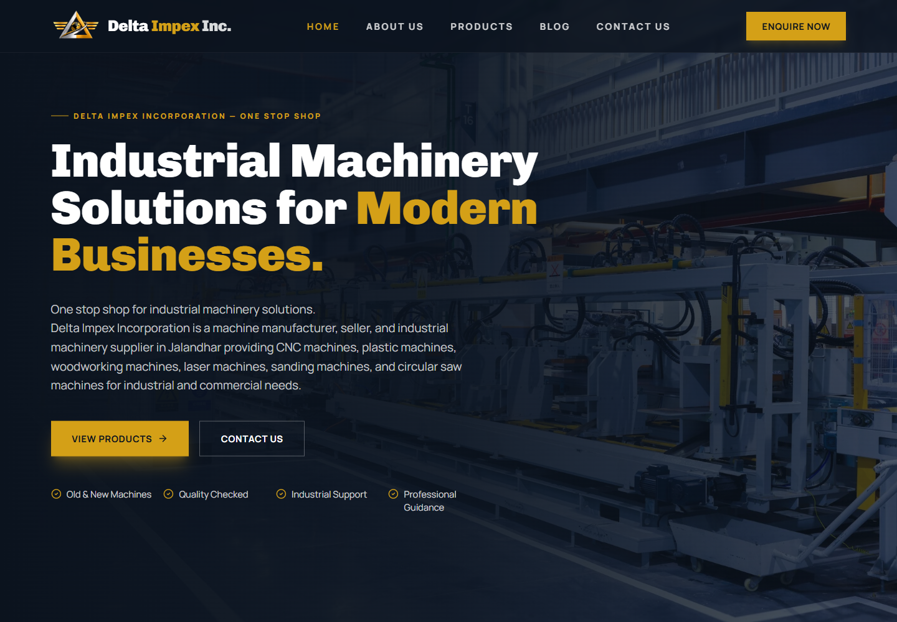
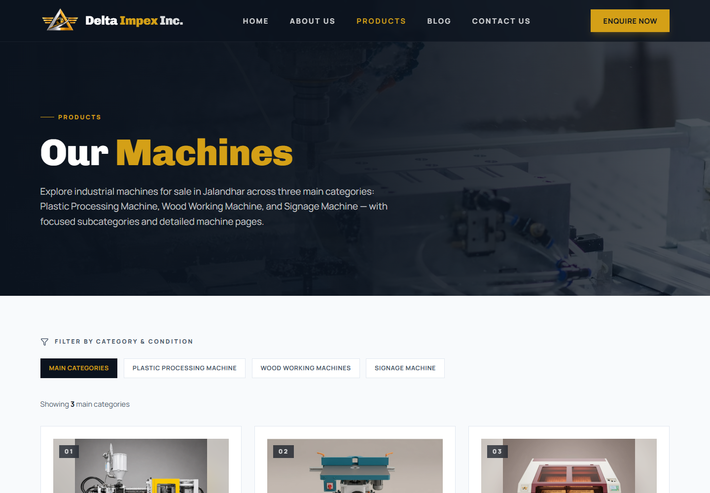
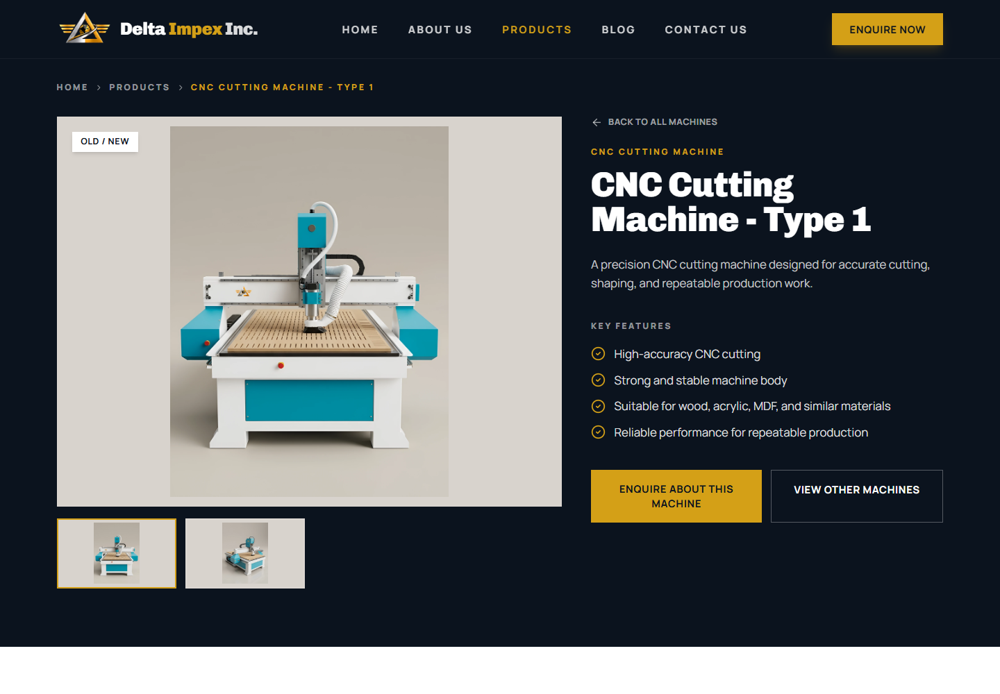

# Delta Impex Inc.

<p align="center">
  
</p>

<h3 align="center">Industrial Machinery Solutions for Modern Businesses</h3>

<p align="center">
  A production-ready React website for Delta Impex Inc., an industrial machinery manufacturer, seller, and supplier in Jalandhar, Punjab.
</p>

<p align="center">
  <a href="https://www.deltaimpexinc.com">Live Website</a>
  |
  <a href="#website-preview">Preview</a>
  |
  <a href="#local-development">Run Locally</a>
  |
  <a href="#deployment">Deploy</a>
</p>

<p align="center">
  
  
  
  
</p>

---

## Website Preview



<table>
  <tr>
    <td width="50%">
      
    </td>
    <td width="50%">
      
    </td>
  </tr>
</table>

## About The Project

Delta Impex Inc. is a modern industrial machinery website built to present product categories, machine details, buyer guides, and enquiry workflows in a clean, trustworthy, and SEO-friendly experience.

The site is designed for machinery buyers who need quick access to product information, current availability, machine applications, and direct enquiry options. It supports new and used industrial machines across CNC, plastic processing, woodworking, laser, sanding, and circular saw categories.

## Highlights

- Product catalog with category filters, subcategories, product detail pages, image galleries, technical specs, and enquiry CTAs.
- Fast React SPA built with Vite, Tailwind CSS, React Router, and reusable UI components.
- Enquiry API for collecting machine requirements and forwarding submissions to a Google Apps Script / Google Sheets workflow.
- SEO setup with canonical metadata, Open Graph tags, Twitter cards, JSON-LD schema, robots.txt, and generated sitemap.
- Blog-ready structure for publishing machinery buying guides and buyer education content.
- Vercel-compatible production deployment with serverless enquiry handling.

## Machine Categories

| Category | Focus |
| --- | --- |
| Plastic Processing Machines | Plastic moulding machines for industrial manufacturing and repeat production. |
| Wood Working Machines | CNC, router, drill, SPM, sanding, and circular saw machines for workshop operations. |
| Signage Machines | Laser cutting and engraving machines for signage, design, and precision production work. |

## Tech Stack

| Layer | Technology |
| --- | --- |
| Frontend | React 19, React Router, Vite |
| Styling | Tailwind CSS, custom CSS, Lucide React icons |
| Data | Local structured catalog, blog, site, and contact data |
| API | Express server and Vercel Function for enquiries |
| SEO | Dynamic metadata, JSON-LD, sitemap generation |
| Deployment | Vercel or Node production server |

## Project Structure

```text
Delta Impex/
|-- api/                 # Vercel enquiry function
|-- docs/readme/         # README preview screenshots
|-- public/              # Logos, favicons, videos, and image assets
|-- scripts/             # Sitemap generation
|-- server/              # Production Express server
|-- src/
|   |-- components/      # Navbar, footer, SEO, forms, product cards
|   |-- data/            # Catalog, blog, contact, and site metadata
|   |-- pages/           # Home, About, Products, Blog, Contact, Detail pages
|   `-- lib/             # API and utility helpers
`-- vercel.json          # Vercel rewrites and deployment config
```

## Local Development

Install dependencies:

```bash
npm install
```

Start the website and enquiry API:

```bash
npm run dev
```

The website runs at:

```text
http://localhost:5173
```

The local enquiry API runs at:

```text
http://localhost:8787
```

## Environment

Copy the example file when environment overrides are needed:

```bash
cp .env.example .env
```

Configure this variable for enquiry submissions:

```text
GOOGLE_SHEETS_WEBHOOK_URL=https://script.google.com/macros/s/YOUR_DEPLOYMENT_ID/exec
```

## Production

Build the site:

```bash
npm run build
```

Start the production server:

```bash
npm start
```

The production server serves the built SPA and `/api/enquiries` from the same Node process.

## Deployment

This project is ready for Vercel.

Use these settings:

| Setting | Value |
| --- | --- |
| Framework Preset | Vite |
| Build Command | `npm run build` |
| Output Directory | `dist` |
| Enquiry Endpoint | `/api/enquiries` |

After deployment, add `GOOGLE_SHEETS_WEBHOOK_URL` in Vercel for Production, Preview, and Development environments.

## SEO Notes

- Canonical URL: `https://www.deltaimpexinc.com`
- Sitemap is generated during every build.
- Product and blog metadata are managed from structured data files.
- Organization, website, product, collection, and breadcrumb schemas are included.
- After production deployment, submit `https://www.deltaimpexinc.com/sitemap.xml` in Google Search Console.

## Contact

Delta Impex Inc.  
No. 111-A, Janta Colony, Near Maqsudan, G.T. Road, Jalandhar, Punjab - 144001, India

Phone: `+91 7669393511`  
Email: `gsbedi99@gmail.com`  
Website: [www.deltaimpexinc.com](https://www.deltaimpexinc.com)

---

<p align="center">
  Built for industrial buyers, workshop owners, and businesses looking for reliable machinery guidance.
</p>
